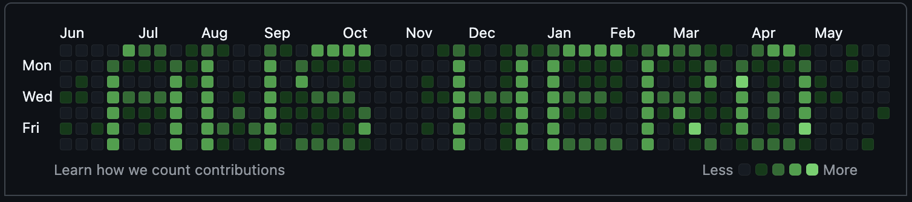

# ✨ GitHub Activity Banner ✨

## 🎨 Create Custom Text in Your GitHub Activity Graph!



## 🚀 What is This?

GitHub Activity Banner is a fun tool that lets you **create custom text patterns** in your GitHub activity graph by generating commits with specific dates. Show off your creativity or highlight your skills with a personalized activity graph!

## ✨ Features

- 🔤 Display custom text messages (up to 9 characters)
- 🎯 Automatically centers your message in the GitHub activity graph
- 🔥 Multiple intensity levels for different visual effects
- 🔄 Easy switching between different messages
- 🛡️ Secure implementation with input validation
- 🧩 Branch-based approach keeps your source code safe

## 🏃‍♂️ Quick Start

```bash
# Clone the repository
git clone https://github.com/yourusername/github-banner.git
cd github-banner

# Run the script
./branch-message.sh
```

Follow the prompts to create your custom activity pattern!

## 📚 Documentation

- [📋 Installation & Setup](INSTALL.md) - How to install and set up the tool
- [🔄 Workflow Guide](WORKFLOW.md) - How to use the branch-based workflow
- [🛡️ Security Information](SECURITY.md) - Security assessment and improvements
- [🤖 Automation](AUTOMATION.md) - How to automate with AWS (coming soon)

## 🖼️ Examples

Here are some ideas for your GitHub activity banner:

- Your name or initials
- Programming languages you know (JS, PYTHON, JAVA)
- Job titles (DEV, SWE, ARCH)
- Fun messages (HI, HELLO)

## 🔒 Security

This tool includes several security improvements:
- Input sanitization to prevent command injection
- Path normalization to prevent path traversal
- Secure command execution patterns

See [SECURITY.md](SECURITY.md) for more details.

## 📝 Usage

For detailed usage instructions:

```bash
node cli.js help
```

## 📜 License

This project is open source and available under the MIT License.

---

⭐ If you find this tool useful, please consider giving it a star! ⭐
